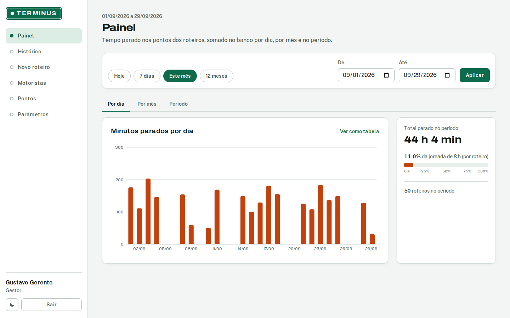
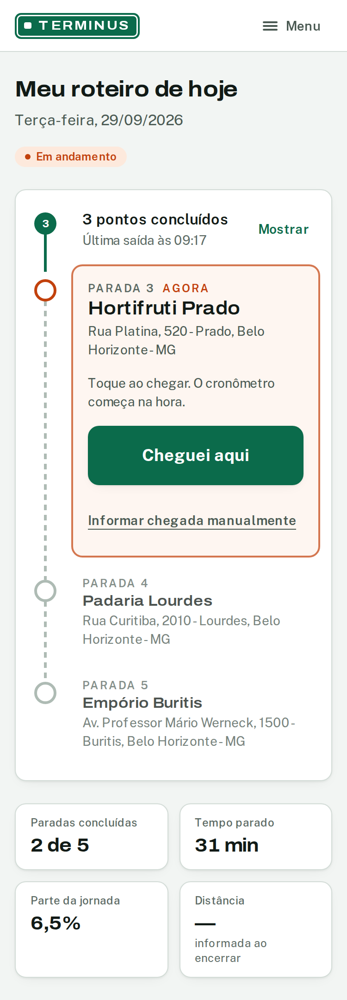
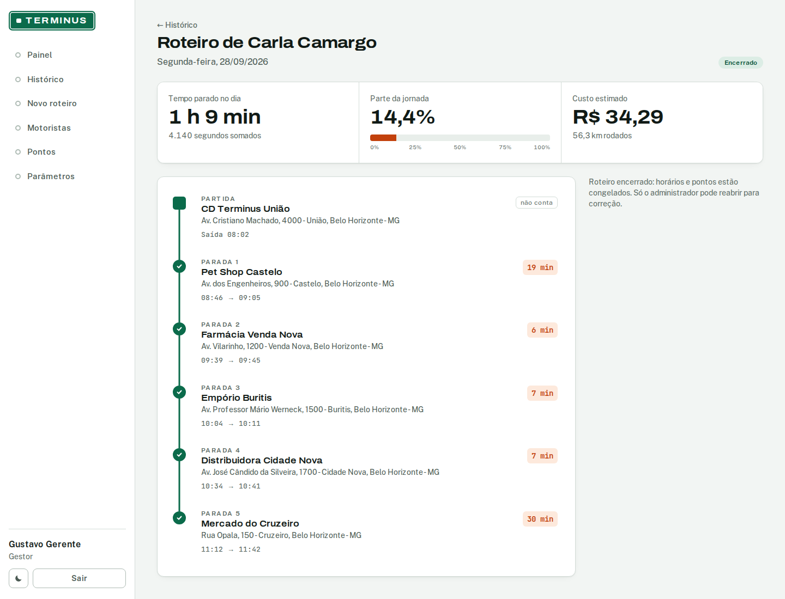
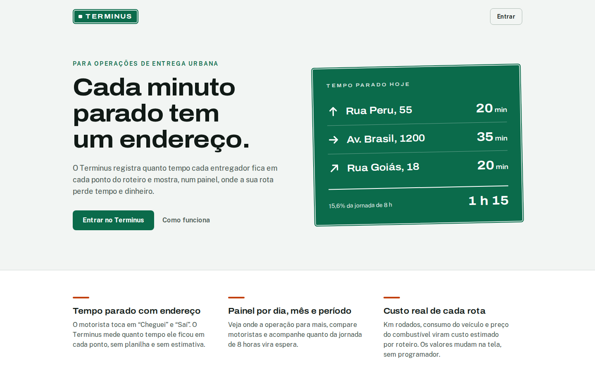

# Campanha de divulgação — Terminus

Material para os pontos extras do 2º Trabalho Avaliativo (melhor nome do
produto e melhor campanha de divulgação, `tp.md` seções 9 e 11). A versão
navegável da campanha está no próprio produto, na página pública
[`/sobre`](http://localhost:3210/sobre) do cliente web (código em
`frontend/app/sobre/page.tsx`; para abrir, siga o README e acesse
`http://localhost:3210/sobre`, sem login).

## O nome

**Terminus** é o ponto final de uma linha, o lugar onde o ônibus ou o trem
para. O problema que o produto resolve é justamente esse: saber onde a rota
para e por quanto tempo. Cada ponto do roteiro é um pequeno terminal, e o
sistema cronometra a permanência do entregador em cada um deles.

Outros motivos para a escolha:

- funciona em português e em inglês sem tradução e sem sotaque forçado;
- é curto, fácil de soletrar por telefone e tem cara de placa de trânsito,
  que é a identidade visual do produto (a marca é uma placa verde de
  indicação, como as das rodovias brasileiras);
- lembra "terminal", palavra que quem trabalha com logística já usa no dia a
  dia (terminal de cargas, centro de distribuição);
- não promete o que o MVP não faz: não diz "rastreamento" nem "otimização",
  que ficaram fora do escopo (`tp.md` 3.2).

O nome de trabalho StopTime continua só nos identificadores técnicos (módulo
Go, bancos, cookie, e-mails de demonstração), conforme a política de nomes do
projeto.

## Slogan

> **Cada minuto parado tem um endereço.**

A frase resume o critério de aceitação que mais pesa para o cliente: todo
tempo parado exibido está ligado a um endereço e a um horário registrados.

## Pitch

Uma empresa de entregas sabe quantas rotas fez no dia, mas não sabe onde os
motoristas ficaram parados nem por quanto tempo. O Terminus resolve isso sem
rastreador no veículo: o gestor monta o roteiro com os pontos em ordem, o
motorista toca em "Cheguei" e "Saí" no celular, e o sistema calcula o tempo
parado em cada endereço (o ponto de partida nunca conta). O painel mostra os
totais por dia, por mês e por período, quanto da jornada de 8 horas virou
espera e o custo estimado de cada rota a partir da distância, do consumo do
veículo e do preço do combustível. Preço do combustível e jornada padrão
mudam na tela de parâmetros, sem programador. Com esses números, a empresa
consegue renegociar prazo com o cliente que segura o entregador 50 minutos na
doca e descobrir quanto cada rota realmente custa.

## Capturas de tela

Capturadas do sistema rodando com os dados de demonstração
(`scripts/dev-seed.sh`), em 29/09/2026.

**1. Painel do gestor, recorte "Este mês", aba "Por dia".** Total parado no
período, percentual da jornada de 8 h e o número de roteiros; as abas "Por
mês" e "Período" ficam ao lado.

**2. O motorista no celular (375 px), rota em andamento.** A próxima parada
aparece em destaque com o botão "Cheguei aqui"; embaixo, paradas concluídas,
tempo parado do dia e a parte da jornada.

**3. Roteiro encerrado.** Cada parada com endereço, horário de chegada e
saída e minutos parados; a partida aparece marcada como "não conta". No topo,
tempo parado do dia, parte da jornada e custo estimado (R$ 34,29 para 56,3
km).

**Página pública da campanha (`/sobre`).**

## Posts para redes sociais

**Instagram** (acompanha a captura 2 ou um carrossel com as três):

> Seu entregador ficou 50 minutos parado numa doca hoje. Você sabia?
>
> O Terminus mostra quanto tempo cada motorista fica em cada ponto do
> roteiro. Ele toca em "Cheguei" e "Saí" no celular, e o painel faz o resto:
> tempo parado por dia, por mês e por período, com endereço e horário.
>
> Cada minuto parado tem um endereço.
>
> #logistica #entregas #lastmile #gestaodefrota #pucminas

**LinkedIn:**

> Quem gerencia entregas urbanas conhece a pergunta sem resposta: onde a
> rota perdeu tempo hoje?
>
> Na disciplina de Engenharia de Software II (PUC Minas) construímos o
> Terminus, um MVP que registra a chegada e a saída do entregador em cada
> ponto do roteiro e transforma isso em indicadores: tempo parado por
> endereço, percentual da jornada de 8 horas que virou espera e custo
> estimado de cada rota. O ponto de partida não conta, e preço do
> combustível e jornada são parâmetros que o gestor ajusta na tela, sem mexer
> no código.
>
> Com esses dados, a operação consegue renegociar prazos com clientes que
> seguram o motorista na doca e saber quanto cada rota custa de verdade.
>
> Cada minuto parado tem um endereço.

## Como reproduzir as capturas

Com o banco de desenvolvimento no ar, os dois servidores rodando (README) e
os dados de demonstração recarregados por `scripts/dev-seed.sh`, as imagens
foram geradas com Playwright (Chromium, locale pt-BR, fuso
America/Sao_Paulo, tema claro, animações reduzidas): painel logado como
`manager@stoptime.dev` em 1440 px, `/hoje` logado como
`driver-a@stoptime.dev` em 375 px (escala 2x), um roteiro encerrado de
`driver-c` do dia anterior e `/sobre` sem login.
