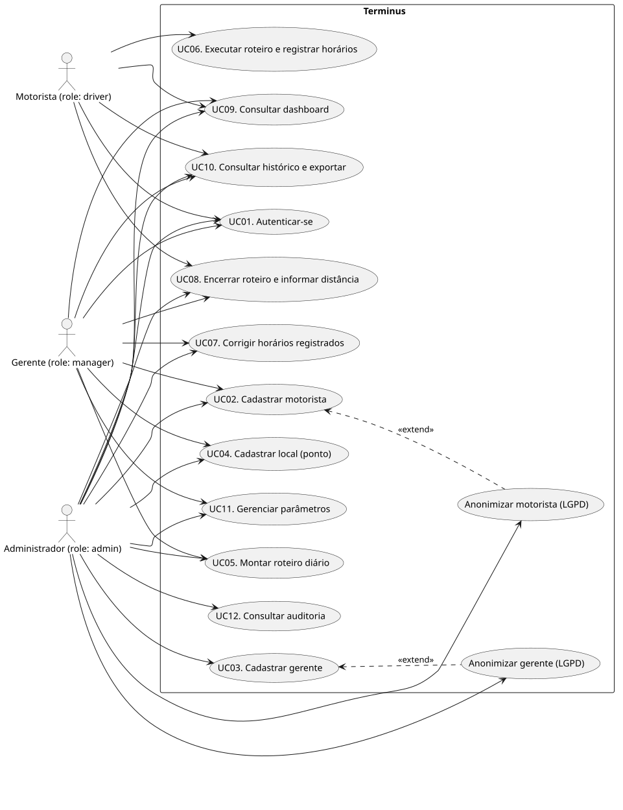
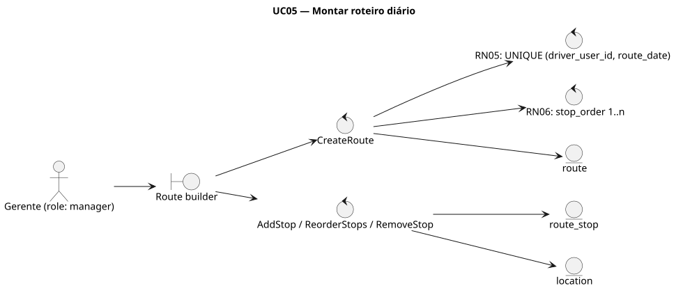
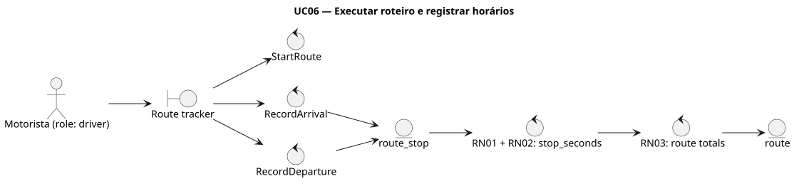
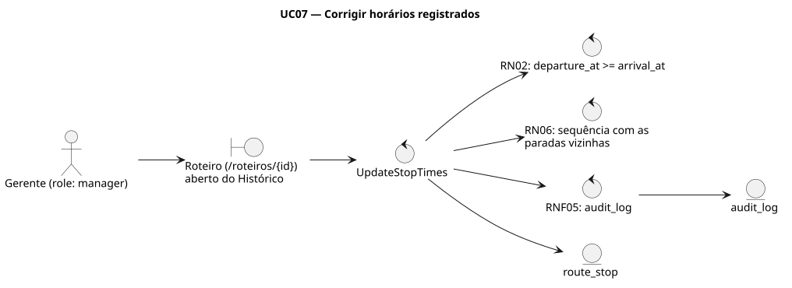
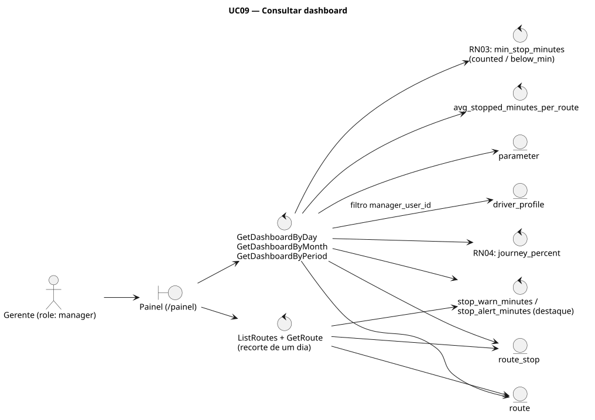
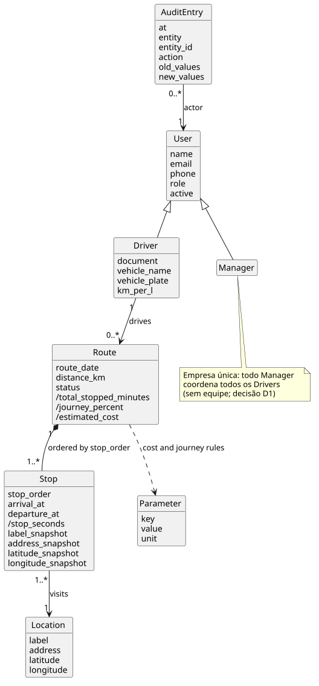

# Especificação do Produto — Terminus

**Disciplina:** Engenharia de Software II — 2º Trabalho Avaliativo
**Entrega:** 1ª parte — Projeto Preliminar (Especificação)
**Produto:** MVP — Sistema de Monitoramento de Tempo Parado em Roteiros

O entregável é o próprio repositório. Este documento é a especificação da 1ª
parte; a 2ª parte (implementação do MVP) está planejada em `plans/` e detalhada
na especificação técnica em inglês, em `docs/spec/`. O documento foi conferido
contra a implementação concluída (código, migrações e testes); a seção 11
resume a arquitetura efetivamente construída.

## Política de nomes deste documento

Identificadores do sistema — tabelas, colunas, classes, atributos, operações,
telas e valores de `role` — aparecem exatamente como existem no código e na
especificação técnica, em inglês (por exemplo, `app_user`, `route_stop`,
`arrival_at`, `CreateRoute`). Nomes traduzidos descreveriam um sistema que não
existe. Toda a prosa explicativa deste documento está em português. Os atores
aparecem como personas (Motorista, Gerente, Administrador), ligadas ao valor
real do campo `role` quando relevante.

O nome do produto é **Terminus**. O nome de trabalho anterior, StopTime,
sobrevive apenas onde é identificador e por isso não se traduz nem se renomeia:
o módulo Go `stoptime`, os bancos `stoptime` e `stoptime_test` e o cookie de
sessão `st_session`.

## 1. Apresentação do produto

Empresas de logística e entrega urbana precisam saber onde e por quanto tempo
seus profissionais de campo ficam parados durante o roteiro diário. Hoje esse
tempo é invisível: não há registro confiável de quanto tempo o entregador, o
motorista ou o transportador permanece em cada ponto do trajeto, o que impede
identificar gargalos, renegociar prazos com clientes e calcular o custo real de
cada rota.

O Terminus é um MVP web que mede esse tempo parado. O produto:

1. Registra motoristas/motoboys, gerentes/coordenadores, locais (pontos) e
   roteiros diários.
2. Coleta, em cada parada do roteiro, o endereço e os horários de chegada e
   saída.
3. Calcula automaticamente o tempo parado por parada e o total do roteiro.
4. Apresenta um dashboard com gráficos de tempo parado por dia, por mês e por
   período, sempre associado aos pontos do roteiro.
5. Calcula indicadores de custo do trajeto (combustível, rendimento km/l,
   custo por km) e o percentual da jornada padrão de 8 h consumido parado.

## 2. Escopo

### 2.1 Dentro do escopo

- Cadastro de motoristas/motoboys, gerentes/coordenadores, locais e roteiros.
- Coleta de dados dos pontos do roteiro (endereço, data/hora de chegada e
  saída).
- Cálculo do tempo parado por ponto e do tempo total parado por roteiro.
- Histórico de pontos e tempos parados por período, com endereços.
- Dashboard com gráficos por dia, por mês e por período.
- Parametrização de custos e da jornada padrão de trabalho (8 h/dia).

### 2.2 Fora do escopo

- Roteirização automática ou otimização de rotas.
- Integração com sistemas de folha de pagamento ou ERP.
- Rastreamento em tempo real com telemetria embarcada no veículo.
- Aplicativo nativo publicado em lojas de aplicativos.

## 3. Requisitos

### 3.1 Regras de negócio

| ID  | Regra                                                                                                                                                                                          |
| --- | ---------------------------------------------------------------------------------------------------------------------------------------------------------------------------------------------- |
| RN01 | O ponto de partida não conta tempo parado: o cronômetro de parada só é considerado a partir do segundo ponto do roteiro (`stop_order = 1` nunca acumula).                                      |
| RN02 | O tempo parado em um ponto é a diferença entre o horário de saída (`departure_at`) e o horário de chegada (`arrival_at`) naquele ponto.                                                        |
| RN03 | O tempo total parado do roteiro é a soma dos tempos parados de todos os pontos, exceto o ponto de partida.                                                                                     |
| RN04 | A jornada padrão de trabalho é de 8 horas por dia e serve de base percentual para os indicadores de tempo parado (`journey_percent`).                                                            |
| RN05 | Cada roteiro pertence a um único motorista/motoboy e a uma única data (restrição `UNIQUE (driver_user_id, route_date)`).                                                                        |
| RN06 | Os pontos de um roteiro possuem ordem sequencial (`stop_order` 1, 2, 3, 4...) que define o trajeto do dia.                                                                                     |
| RN07 | O custo do trajeto é calculado a partir do valor do combustível, do rendimento km/litro do veículo e da distância percorrida (`distance_km`).                                                    |

### 3.2 Requisitos funcionais

| ID   | Requisito                                                                                          | Prioridade |
| ---- | -------------------------------------------------------------------------------------------------- | ---------- |
| RF01 | Cadastrar dados do motorista/motoboy (nome, telefone, documento, veículo).                         | Alta       |
| RF02 | Cadastrar dados do gerente/coordenador (nome, telefone, e-mail).                                    | Alta       |
| RF03 | Cadastrar pontos com endereço e coordenadas.                                                        | Alta       |
| RF04 | Montar o roteiro diário associando pontos em ordem sequencial a um motorista e a uma data.          | Alta       |
| RF05 | Registrar chegada e saída em cada ponto (data/hora) para coleta do tempo parado.                     | Alta       |
| RF06 | Calcular automaticamente o tempo parado por ponto e o total do roteiro.                             | Alta       |
| RF07 | Exibir histórico de pontos e tempos parados por período, com endereços.                             | Alta       |
| RF08 | Exibir dashboard com gráficos de tempo parado por dia, por mês e por período.                       | Alta       |
| RF09 | Parametrizar custos: valor do combustível, km/litro do veículo, custo por km percorrido.             | Média      |
| RF10 | Parametrizar regras de cálculo do tempo parado e a jornada padrão (8 h/dia).                          | Média      |
| RF11 | Calcular o custo estimado do roteiro a partir dos parâmetros e da distância percorrida.               | Média      |
| RF12 | Exportar relatórios do período consultado.                                                           | Baixa      |

### 3.3 Requisitos não funcionais

| ID    | Requisito                                                                                          |
| ----- | --------------------------------------------------------------------------------------------------- |
| RNF01 | Persistência dos dados em banco de dados, garantindo o histórico completo dos roteiros.             |
| RNF02 | Interface web responsiva, utilizável em desktop e em dispositivos móveis pelo entregador.           |
| RNF03 | Tempo de resposta do dashboard inferior a 3 segundos para consultas de até 12 meses.                |
| RNF04 | Controle de acesso por perfil: motorista/motoboy, gerente/coordenador e administrador.               |
| RNF05 | Registro de auditoria das alterações em pontos e horários.                                           |
| RNF06 | Aderência à LGPD no tratamento dos dados pessoais dos profissionais de campo.                        |

## 4. Atores

| Ator (persona)          | Valor de `role` | O que faz no sistema                                                                                       |
| ----------------------- | -------------- | ----------------------------------------------------------------------------------------------------------- |
| Motorista / Motoboy     | `driver`       | Executa o próprio roteiro do dia e registra chegada e saída em cada parada; informa a distância percorrida. |
| Gerente / Coordenador  | `manager`      | Cadastra motoristas e locais, monta roteiros, corrige horários, consulta dashboards e histórico, ajusta parâmetros. |
| Administrador (dono)   | `admin`        | Tudo o que o gerente faz, mais contas de gerente, consulta de auditoria, reabertura de roteiros e anonimização de motoristas (LGPD). |

O enunciado agrupa gerente, coordenador e dono da transportadora numa só
entidade. Aqui o dono é o Administrador (`admin`), e gerente e coordenador são
o mesmo papel (`manager`). O MVP atende uma única empresa: todo gerente
coordena todos os motoristas, sem equipe atribuída (decisão D1, seção 10.4).

## 5. Casos de uso

### 5.1 Diagrama de casos de uso



Fonte: [`especificacao/diagrams/casos-de-uso.puml`](especificacao/diagrams/casos-de-uso.puml) (PlantUML).

O caso "Anonimizar motorista (LGPD)" estende UC02 e é exclusivo do
Administrador; está descrito como extensão de UC02 (operação `AnonymizeDriver`).

### 5.2 Descrição dos casos de uso

**UC01 — Autenticar-se.**
Ator: todos. Pré-condição: conta ativa (`active = true`).
Fluxo principal: 1) o usuário informa `email` e `password` na tela de login;
2) o sistema valida a senha (bcrypt); 3) o sistema emite a sessão (cookie
assinado com HMAC-SHA256 `st_session`, validade de 12 h); 4) o
redirecionamento segue o `role`: `driver` vai para a tela Route tracker, os
demais para o Dashboard; 5) ao abrir o cliente web com um cookie já existente,
o sistema confirma a sessão com `CurrentUser` (`GET /api/auth/me`), que relê o
usuário no banco.
Fluxos alternativos: 2a) credenciais inválidas ou conta desativada → mensagem
de erro genérica (sem revelar qual campo falhou), nenhuma sessão; 5a) sessão
expirada ou usuário desativado depois do login → `ErrUnauthenticated` (401) e
volta à tela de login.
Pós-condição: sessão ativa. Operações: `Login`, `Logout`, `CurrentUser`.

**UC02 — Cadastrar motorista.**
Ator: Gerente, Administrador. Pré-condição: sessão autenticada com `role`
`manager` ou `admin`.
Fluxo principal: 1) o gerente informa `name`, `email`, `password`, `phone` e,
opcionalmente, `document`, `vehicle_name`, `vehicle_plate` e `km_per_l`;
2) o sistema cria o `app_user` com `role = driver` e o `driver_profile` na
mesma transação; 3) o motorista passa a aparecer no diretório.
Fluxos alternativos: 2a) e-mail já cadastrado → `ErrDuplicateEmail`, erro
exibido no campo; 3a) para o Gerente, o `document` aparece mascarado no
diretório e nas respostas (só os dois últimos dígitos visíveis, por exemplo
`***.***.***-44`, com `document_masked = true`); o Administrador vê o valor
completo (`document_masked = false`). Reenviar o valor mascarado no formulário
de edição mantém o documento gravado (RNF06); 3b) desligamento do motorista →
`UpdateDriver` com `active = false`: ele sai dos seletores e não consegue mais
entrar, e o histórico de roteiros permanece.
Extensão (somente Administrador) — Anonimizar motorista (LGPD): 1) o
administrador pede a anonimização de um motorista; 2) o sistema troca `name`
e `email` por pseudônimos (`Motorista removido <8 primeiros caracteres do id>`
e `removido-<id>@anonimo.invalid`), apaga `phone`, `document`, `vehicle_name` e
`vehicle_plate`, torna a senha inutilizável e desativa a conta
(`active = false`), numa transação que grava uma entrada em `audit_log` com
`entity = app_user` e `action = anonymize` (a entrada nomeia os campos
apagados, nunca os valores); 3) os roteiros e tempos do motorista continuam no
histórico e nos agregados, e `km_per_l`, que não é dado pessoal, continua
alimentando o custo (RN07). Repetir a operação devolve o mesmo resultado, sem
nova auditoria.
Pós-condição: motorista cadastrado (ou desativado/anonimizado). Operações:
`CreateDriver`, `ListDrivers`, `UpdateDriver`, `AnonymizeDriver`.

**UC03 — Cadastrar gerente.**
Ator: Administrador. Mesmo formato de UC02, sem perfil de veículo: cria um
`app_user` com `role = manager`. Operações: `CreateManager`, `ListManagers`.

**UC04 — Cadastrar local (ponto).**
Ator: Gerente, Administrador.
Fluxo principal: 1) informa `label`, `address` e, opcionalmente, `latitude` e
`longitude`; 2) o sistema persiste em `location`.
Fluxo alternativo: endereço vazio → erro de campo.
Este é o primeiro passo da coleta de pedidos (enunciado, seção 9; ver 10.2): o
endereço de cada pedido de entrega é cadastrado como um `location`; um endereço
que recebe pedidos com frequência é cadastrado uma vez e reaproveitado.
Pós-condição: local disponível para montagem de roteiros. Operações:
`CreateLocation`, `UpdateLocation`, `ListLocations`.

**UC05 — Montar roteiro diário.**
Ator: Gerente (Administrador substitui). Pré-condição: motorista e locais
cadastrados.
Fluxo principal: 1) o gerente seleciona `driver_user_id` e `route_date`;
2) o sistema verifica RN05 (um único roteiro por motorista e data); 3) o gerente
adiciona locais na ordem de visita e o sistema numera `stop_order` de 1 a n
(RN06); 4) ao salvar, o roteiro é criado com `status = draft`; o primeiro ponto
é a partida e nunca acumula tempo parado (RN01).
Fluxos alternativos: 2a) já existe roteiro para o motorista na data → o sistema
exibe o existente (RN05); 3a) menos de duas paradas → erro de campo.
Pós-condição: roteiro `draft` com paradas ordenadas. Operações: `CreateRoute`,
`AddStop`, `RemoveStop`, `ReorderStops`.

**UC06 — Executar roteiro e registrar horários.**
Ator: Motorista (Gerente e Administrador também podem registrar). Pré-condição:
existe roteiro próprio na data, em `draft` ou `active`.
Fluxo principal: 1) o motorista abre a tela Route tracker e o sistema mostra o
roteiro do dia; se ainda estiver em `draft`, ele o inicia (`StartRoute`,
`status = active`); 2) em cada parada a partir da segunda (RN01), ele marca a
chegada e o sistema grava `arrival_at`; 3) ao sair, marca a saída e o sistema
grava `departure_at`; 4) o sistema calcula `stop_seconds` por parada (RN02) e o
total do roteiro (RN03).
Fluxos alternativos: 1a) sem roteiro na data → estado vazio com orientação de
contatar o coordenador; 3a) registro em atraso → entrada manual de data/hora em
campo ainda vazio (correções de valor já gravado passam por UC07).
Pós-condição: paradas contadas com chegada e saída; totais visíveis.
Operações: `StartRoute`, `RecordArrival`, `RecordDeparture`, `GetRoute`.

**UC07 — Corrigir horários registrados.**
Ator: Gerente (Administrador). Pré-condição: o roteiro existe e não está
`closed`.
Fluxo principal: 1) o gerente abre o detalhe do roteiro na tela History;
2) edita `arrival_at` ou `departure_at` (campo deixado em branco mantém o valor
atual); 3) o sistema valida RN02
(`departure_at >= arrival_at`) e persiste; 4) grava auditoria com valores
antigos e novos (RNF05); 5) os totais recalculam na leitura seguinte.
Fluxos alternativos: 3a) par de horários inválido → `ErrDepartureBeforeArrival`,
sem auditoria; 3b) roteiro `closed` → `ErrRouteClosed` (reabertura é ação do
administrador, auditada).
Pós-condição: correção persistida e rastreável. Operações: `UpdateStopTimes`,
`ListAudit`.

**UC08 — Encerrar roteiro e informar distância.**
Ator: Motorista (Gerente e Administrador substituem). Pré-condição: roteiro
próprio ainda não encerrado (`draft` ou `active`; normalmente `active` com
horários registrados).
Fluxo principal: 1) o motorista informa `distance_km` (odômetro ou estimativa);
2) encerra o roteiro; 3) o sistema congela composição e horários
(`status = closed`) e apresenta o custo estimado (RN07) e o percentual da
jornada (RN04, padrão de 8 h/dia).
Fluxo alternativo: 3a) sem `distance_km` → o custo fica indefinido (`null`,
nunca zero) até a distância ser informada.
Pós-condição: roteiro somente leitura; só o Administrador o reabre
(`ReopenRoute`, auditado). Operações: `SetRouteDistance`, `CloseRoute`,
`ReopenRoute`.

**UC09 — Consultar dashboard.**
Ator: Gerente e Administrador (o Motorista vê apenas os próprios dados).
Fluxo principal: 1) escolhe um período (predefinido ou personalizado); 2) o
sistema agrega em SQL os minutos parados por dia (`GetDashboardByDay`), por mês
(`GetDashboardByMonth`) e o total do período com ranking por motorista
(`GetDashboardByPeriod`); 3) os gráficos recebem apenas séries agregadas e
nunca somam linhas no cliente; 4) o percentual da jornada (RN04) aparece por
dia, no total do período e por motorista, sempre sobre um dia padrão de 8 h
por roteiro trabalhado: `journey_percent` = segundos parados /
(`routes_count` × `standard_journey_hours` × 3600) × 100.
Fluxo alternativo: 1a) período sem dados → séries vazias, total 0 e
`journey_percent` `"0.000"`.
RNF03: resposta inferior a 3 s para janelas de até 12 meses, verificada em
teste automatizado com 36 meses de dados sintéticos (cerca de 4.700 roteiros e
28 mil paradas) consultados numa janela de 12 meses.
Pós-condição: os três recortes pedidos (dia, mês, período) visíveis.
Operações: `GetDashboardByDay`, `GetDashboardByMonth`, `GetDashboardByPeriod`.

**UC10 — Consultar histórico e exportar.**
Ator: Gerente e Administrador (o Motorista vê apenas os próprios dados).
Fluxo principal: 1) filtra por período (padrão: mês corrente), motorista e
`status`; 2) o sistema
lista os roteiros com totais e custos; 3) o detalhe do roteiro mostra cada
parada com endereço e horários (RF07); 4) exporta o período consultado em CSV
(RF12; UTF-8 com BOM, RFC 4180).
Pós-condição: relatório consultado/exportado. Operações: `ListRoutes`,
`GetRoute`, `ExportPeriodCSV`.

**UC11 — Gerenciar parâmetros.**
Ator: Gerente, Administrador.
Fluxo principal: 1) abre a tela Parameters e o sistema lista `fuel_price_brl`,
`cost_per_km_brl`, `default_km_per_l`, `standard_journey_hours` (padrão 8) e
`min_stop_minutes`; 2) edita um valor; 3) o sistema valida e persiste, gravando
auditoria (RNF05); 4) as leituras seguintes recalculam custo (RN07) e
percentual da jornada (RN04) com o novo valor.
Pós-condição: parâmetro alterado sem mudança de código (critério de aceitação).
Operações: `GetParams`, `UpdateParam`.

**UC12 — Consultar auditoria.**
Ator: Administrador.
Fluxo principal: 1) filtra por `entity` e período; 2) o sistema lista as
entradas de `audit_log` (as mais recentes primeiro, até 200) com autor
(`actor_user_id`), ação (`action`) e valores antigos/novos (`old_values`,
`new_values`).
Pós-condição: alterações em pontos e horários rastreáveis (RNF05). Operações:
`ListAudit`.

## 6. Diagramas de robustez

O diagrama de robustez (análise de robustez, Jacobson/ICONIX) reconta o fluxo
de um caso de uso com quatro estereótipos: **ator** (boneco), **boundary**
(interface com o usuário, círculo com traço vertical), **control** (lógica da
aplicação, círculo com seta) e **entity** (dados persistentes, círculo com traço
horizontal). Ele valida, antes do detalhamento, que cada passo do caso de uso
tem um lugar claro no desenho. Nesta especificação, os elementos seguem o
mesmo vínculo em toda parte: boundaries são telas (de `docs/spec/screens.md`),
controls são operações (de `docs/spec/operations.md`) ou regras de negócio, e
entities são tabelas (de `docs/spec/data-model.md`). As telas são contratos de
estado, não de marcação: o cliente web em Next.js as realiza em português, e as
páginas htmx servidas pelo próprio backend Go (transporte legado, ainda coberto
por testes) realizam os mesmos estados sobre as mesmas operações (seção 11).

### UC05 — Montar roteiro diário



A tela Route builder aciona `CreateRoute`, que aplica RN05 (unicidade
motorista+data) e RN06 (numeração sequencial) e grava `route` e as paradas
iniciais em `route_stop`, a partir dos locais escolhidos em `location`; as
edições de composição (`AddStop`, `ReorderStops`, `RemoveStop`) regravam
`route_stop` e registram cada alteração em `audit_log` na mesma transação
(RNF05).

Fonte: [`robustez-uc05-montar-roteiro.puml`](especificacao/diagrams/robustez-uc05-montar-roteiro.puml)

### UC06 — Executar roteiro e registrar horários



A tela Route tracker aciona `StartRoute`, que muda o `status` de `route` para
`active`, e `RecordArrival` e `RecordDeparture`, que gravam `arrival_at` e
`departure_at` em `route_stop` (apenas em campo vazio); o cálculo de
`stop_seconds` (RN01+RN02) e o total do roteiro (RN03) completam o fluxo até
`route`.

Fonte: [`robustez-uc06-registrar-tempos.puml`](especificacao/diagrams/robustez-uc06-registrar-tempos.puml)

### UC07 — Corrigir horários registrados



Na tela History (detalhe do roteiro), `UpdateStopTimes` valida RN02
(`departure_at >= arrival_at`), altera `route_stop` e grava a auditoria em
`audit_log` na mesma transação (RNF05).

Fonte: [`robustez-uc07-corrigir-tempos.puml`](especificacao/diagrams/robustez-uc07-corrigir-tempos.puml)

### UC09 — Consultar dashboard



A tela Dashboard aciona `GetDashboardByDay`, `GetDashboardByMonth` e
`GetDashboardByPeriod`, que agregam `route_stop` e `route` em SQL, leem
`parameter` para o limiar `min_stop_minutes` (RN03) e para a jornada
`standard_journey_hours` do percentual (RN04), e devolvem séries agregadas aos
gráficos. O dashboard não mostra custo; o custo estimado (RN07) aparece no
detalhe e no histórico dos roteiros (UC08, UC10).

Fonte: [`robustez-uc09-dashboard.puml`](especificacao/diagrams/robustez-uc09-dashboard.puml)

## 7. Diagrama de classes conceitual



Fonte: [`classes-conceituais.puml`](especificacao/diagrams/classes-conceituais.puml)

Atributos precedidos de `/` são derivados: calculados a partir de outros
dados, nunca armazenados (`/stop_seconds` por RN01+RN02,
`/total_stopped_minutes` por RN03, `/journey_percent` por RN04 e
`/estimated_cost` por RN07).

Correspondência entre as classes conceituais e as tabelas de persistência:

| Classe     | Tabelas                                              |
| ---------- | ---------------------------------------------------- |
| User       | `app_user`                                           |
| Driver     | `app_user` (`role = driver`) + `driver_profile`      |
| Manager    | `app_user` (`role = manager`)                        |
| Route      | `route`                                              |
| Stop       | `route_stop`                                         |
| Location   | `location`                                           |
| Parameter  | `parameter`                                          |
| AuditEntry | `audit_log`                                          |

`Manager` não tem associação com `Driver`: o MVP atende uma única empresa e
todo gerente coordena todos os motoristas (decisão D1, seção 10.4).

## 8. Diagrama entidade-relacionamento (notação crow's foot)

O diagrama abaixo é renderizado em Mermaid (a notação `erDiagram` do Mermaid é
crow's foot) e espelha o modelo de dados autoritativo, definido em
`docs/spec/data-model.md` e implementado nas migrações SQL de `db/migrations/`.

```mermaid
erDiagram
    APP_USER ||--o| DRIVER_PROFILE : "user_id"
    APP_USER ||--o{ ROUTE : "driver_user_id"
    APP_USER ||--o{ ROUTE : "created_by"
    APP_USER ||--o{ LOCATION : "created_by"
    APP_USER ||--o{ PARAMETER : "updated_by"
    APP_USER ||--o{ AUDIT_LOG : "actor_user_id"
    ROUTE ||--|{ ROUTE_STOP : "route_id"
    LOCATION ||--o{ ROUTE_STOP : "location_id"

    APP_USER {
        uuid id PK
        text name
        text email UK
        text phone
        text password_hash
        text role "admin|manager|driver"
        bool active
        timestamptz created_at
    }
    DRIVER_PROFILE {
        uuid user_id PK_FK
        text document
        text vehicle_name
        text vehicle_plate
        numeric km_per_l "opcional; substitui default_km_per_l"
    }
    LOCATION {
        uuid id PK
        text label
        text address
        numeric latitude "opcional"
        numeric longitude "opcional"
        uuid created_by FK
        timestamptz created_at
    }
    ROUTE {
        uuid id PK
        uuid driver_user_id FK
        date route_date "UNIQUE com driver_user_id"
        numeric distance_km "opcional, digitada"
        text status "draft|active|closed"
        text note "opcional"
        uuid created_by FK
        timestamptz created_at
    }
    ROUTE_STOP {
        uuid id PK
        uuid route_id FK
        int stop_order "1..n; 1 = partida"
        uuid location_id FK
        timestamptz arrival_at "opcional"
        timestamptz departure_at "opcional"
        int stop_seconds "gerada; RN01+RN02"
        text note "opcional"
    }
    PARAMETER {
        text key PK
        numeric value
        text unit
        uuid updated_by FK
        timestamptz updated_at
    }
    AUDIT_LOG {
        uuid id PK
        timestamptz at
        uuid actor_user_id FK
        text entity
        text entity_id "uuid ou key de parameter"
        text action
        jsonb old_values
        jsonb new_values
    }
```

Notas: os rótulos das relações são as colunas de chave estrangeira. O esquema
vem de duas migrações: `0001_init.sql` cria as tabelas e `0002_audit_entity_id_text.sql`
muda `audit_log.entity_id` de `uuid` para `text`, porque a auditoria de
`UpdateParam` precisa guardar a chave textual do parâmetro (por exemplo,
`fuel_price_brl`). `stop_seconds` é uma coluna gerada no banco (RN01 e RN02
aplicados no próprio esquema), e `CHECK (departure_at >= arrival_at)` garante
RN02; `app_user.email` é único sem diferenciar maiúsculas (índice sobre
`lower(email)`). `parameter` não tem relação com `route`: as leituras aplicam os
valores vigentes. Totais e custo nunca são armazenados, são calculados na
leitura; `schema_migrations` controla as migrações e não aparece no modelo
conceitual.

### 8.1 Correspondência com o modelo de dados do enunciado

A seção 8 do enunciado lista cinco entidades. Cada atributo pedido tem lugar
no esquema, armazenado ou calculado na leitura:

| Entidade do enunciado                  | Atributo pedido                         | Onde está                                                                                                   |
| -------------------------------------- | --------------------------------------- | ----------------------------------------------------------------------------------------------------------- |
| Ponto                                  | id, endereço, latitude, longitude       | `location` (`id`, `label`, `address`, `latitude`, `longitude`)                                               |
| Ponto                                  | data/hora de chegada e de saída         | `route_stop.arrival_at`, `route_stop.departure_at`                                                          |
| Ponto                                  | tempo parado calculado                  | `route_stop.stop_seconds` (coluna gerada, RN01+RN02)                                                        |
| Ponto                                  | ordem no roteiro                        | `route_stop.stop_order`                                                                                      |
| Roteiro                                | id, data, motorista responsável         | `route` (`id`, `route_date`, `driver_user_id`)                                                              |
| Roteiro                                | lista ordenada de pontos                | linhas de `route_stop` do roteiro, ordenadas por `stop_order`                                               |
| Roteiro                                | distância total                         | `route.distance_km` (digitada; decisão D3)                                                                  |
| Roteiro                                | tempo total parado, custo estimado      | calculados na leitura: `total_stopped_minutes` (RN03) e `estimated_cost_brl` (RN07) em `GetRoute`/`ListRoutes` |
| Motorista / Motoboy                    | id, nome, telefone                      | `app_user` (`id`, `name`, `phone`) com `role = driver`                                                      |
| Motorista / Motoboy                    | documento, veículo, rendimento km/litro | `driver_profile` (`document`, `vehicle_name`, `vehicle_plate`, `km_per_l`)                                  |
| Gerente / Coord. / Dono transportadora | id, nome, telefone, e-mail              | `app_user` (`id`, `name`, `phone`, `email`) com `role = manager` (gerente/coordenador) ou `role = admin` (dono) |
| Gerente / Coord. / Dono transportadora | equipe sob responsabilidade             | sem tabela: empresa única, todo gerente coordena todos os motoristas (decisão D1)                           |
| Parâmetro                              | valor do combustível, custo por km      | `parameter` com `key` `fuel_price_brl` e `cost_per_km_brl`                                                   |
| Parâmetro                              | km/litro do veículo                     | `parameter` `default_km_per_l` (padrão da frota), substituído por `driver_profile.km_per_l` quando informado |
| Parâmetro                              | jornada padrão (8 h/dia)                | `parameter` `standard_journey_hours`                                                                         |
| Parâmetro                              | regras de cálculo do tempo parado       | `parameter` `min_stop_minutes` (limiar abaixo do qual a parada não conta); RN01 e RN02 ficam no esquema      |

O Ponto do enunciado virou duas tabelas porque junta dois conceitos: o local
(endereço e coordenadas, cadastrado uma vez e reutilizado em muitos roteiros)
e a visita a esse local num roteiro (ordem e horários). Com uma tabela só, o
mesmo endereço seria redigitado a cada dia e o histórico por endereço
dependeria de texto idêntico.

## 9. Exemplo de referência (dados de validação)

O exemplo do enunciado é a fixture de teste do projeto (semente dourada em
`db/seed/golden.sql`, data 2026-06-15). O ponto 1 é a partida e não acumula
tempo parado (RN01). Como RN05 permite um só roteiro por motorista e data, os
três roteiros do mesmo dia exigem três motoristas: a semente cria cinco
usuários de demonstração (um `admin`, um `manager` e os motoristas A, B e C).
O veículo do motorista B tem `km_per_l = 12.50`, e A e C usam o parâmetro
`default_km_per_l`, exercitando os dois ramos de RN07. O enunciado não informa
os endereços dos pontos de B e C nem o endereço da partida de A; a semente usa
endereços provisórios nesses pontos.

| Roteiro | Ponto / Endereço            | Tempo parado | Observação                       |
| ------- | --------------------------- | ------------ | -------------------------------- |
| A       | 1 — Seg. Família (partida)  | 0            | Ponto de partida não conta tempo |
| A       | 2 — Rua Peru, 55            | 15 min       | Parada intermediária             |
| A       | 3 — Rua X, 5                | 10 min       | Parada intermediária             |
| A       | 4 — Av. João César          | 50 min       | Ponto final                      |
| B       | 1 — Partida                 | 0            | Não conta tempo                  |
| B       | 2                           | 10 min       |                                  |
| B       | 3                           | 5 min        |                                  |
| B       | 4                           | 26 min       |                                  |
| C       | 1 — Partida                 | 0            | Não conta tempo                  |
| C       | 2                           | 5 min        |                                  |
| C       | 3                           | 10 min       |                                  |
| C       | 4                           | 30 min       |                                  |

Totais esperados, verificados em todas as camadas (SQL, regras de domínio e
dashboard): roteiro A = 75 min; roteiro B = 41 min; roteiro C = 45 min; dia
com os três roteiros = 161 min. Percentual da jornada do roteiro A com o padrão
de 8 h: 75/480 = 15,625%. Percentual da jornada do dia e do período (RN04, um
dia padrão por roteiro trabalhado): 161 / (3 × 480) = 11,181%. Com
`min_stop_minutes = 6`, a parada de 5 min do roteiro B deixa de contar e B
passa a 36 min (RF10).

Para demonstração há uma segunda carga, separada da fixture de teste:
`db/seed/demo/demo.sql`, aplicada por `scripts/dev-seed.sh` somente no banco de
desenvolvimento `stoptime`. Ela acrescenta 16 locais de Belo Horizonte, cerca de
8 semanas de roteiros encerrados dos motoristas A, B e C relativos à data
corrente, o roteiro `active` de hoje do motorista A e o roteiro `draft` de
amanhã do motorista B. Os testes usam só a semente dourada.

## 10. Matriz de rastreabilidade

| UC   | Requisitos       | Regras     | Operações                                                                   |
| ---- | ---------------- | ---------- | --------------------------------------------------------------------------- |
| UC01 | RNF04            |            | `Login`, `Logout`, `CurrentUser`                                             |
| UC02 | RF01, RNF06      |            | `CreateDriver`, `UpdateDriver`, `ListDrivers`, `AnonymizeDriver`              |
| UC03 | RF02             |            | `CreateManager`, `ListManagers`                                               |
| UC04 | RF03             |            | `CreateLocation`, `UpdateLocation`, `ListLocations`                          |
| UC05 | RF04             | RN01, RN05, RN06 | `CreateRoute`, `AddStop`, `RemoveStop`, `ReorderStops`                 |
| UC06 | RF05, RF06       | RN01, RN02, RN03 | `StartRoute`, `RecordArrival`, `RecordDeparture`, `GetRoute`           |
| UC07 | RF05, RNF05      | RN02       | `UpdateStopTimes`, `ListAudit`                                                |
| UC08 | RF11             | RN04, RN07 | `SetRouteDistance`, `CloseRoute`, `ReopenRoute`                               |
| UC09 | RF08, RNF03      | RN03, RN04 | `GetDashboardByDay`, `GetDashboardByMonth`, `GetDashboardByPeriod`            |
| UC10 | RF07, RF12       |            | `ListRoutes`, `GetRoute`, `ExportPeriodCSV`                                  |
| UC11 | RF09, RF10, RF11 | RN03, RN04, RN07 | `GetParams`, `UpdateParam`                                              |
| UC12 | RNF05            |            | `ListAudit`                                                                   |

Requisitos não funcionais e onde são atendidos:

| RNF    | Onde é atendido                                                                                                |
| ------ | ---------------------------------------------------------------------------------------------------------------- |
| RNF01  | `docs/spec/data-model.md` (PostgreSQL, histórico completo) e migrações em `db/migrations/`                        |
| RNF02  | Cliente web Next.js responsivo (Tailwind), com a tela Route tracker pensada primeiro para o celular; estados por tela em `docs/spec/screens.md` |
| RNF03  | Agregação em SQL com índice `route_route_date_idx`; teste automatizado de 12 meses sobre 36 meses sintéticos (dia 4,6 ms, mês 4,7 ms, período 7,1 ms) — `docs/spec/business-rules.md` |
| RNF04  | Sessão assinada `st_session` e matriz de papéis por operação, aplicada na camada de serviço e testada célula a célula — `docs/spec/operations.md` |
| RNF05  | `audit_log` escrito na mesma transação de cada alteração de horários/composição/parâmetros                       |
| RNF06  | Minimização, visibilidade por papel, `document` mascarado para o Gerente, desativação e anonimização (`AnonymizeDriver`) auditadas — seção 10.1 e `docs/spec/data-model.md` |

Todas as regras de negócio aparecem na matriz: RN01 (UC05, UC06), RN02 (UC06,
UC07), RN03 (UC06, UC09, UC11), RN04 (UC08, UC09, UC11), RN05 e RN06 (UC05) e
RN07 (UC08, UC11). As operações `ListDrivers`, `ListLocations` e `ListManagers`
também alimentam as telas de outros casos de uso (por exemplo, os seletores da
tela Route builder).

### 10.1 Tratamento de dados pessoais (RNF06)

Os profissionais de campo são titulares de dados pessoais no sentido da LGPD. O
MVP trata esses dados assim:

- **Minimização.** O esquema guarda só o que os requisitos pedem: `name`,
  `phone` e `email` em `app_user` e, para motoristas, `document`,
  `vehicle_name`, `vehicle_plate` e `km_per_l` em `driver_profile` (RF01,
  RF02). Não há coleta de localização contínua: os horários são registrados
  por ação do motorista em cada parada, e rastreamento em tempo real está fora
  do escopo (enunciado, seção 3.2). A senha é guardada só como hash bcrypt.
- **Visibilidade por papel (RNF04).** O Motorista vê apenas os próprios
  roteiros, histórico e dashboard; o Gerente vê os dados operacionais de todos
  os motoristas; o Administrador vê tudo. A regra é aplicada na camada de
  serviço, operação a operação, e não só escondida na interface.
- **Mascaramento.** Para o Gerente, o `document` do motorista sai mascarado em
  toda resposta (`CreateDriver`, `UpdateDriver`, `ListDrivers`): só os dois
  últimos dígitos ficam visíveis (`***.***.***-44`) e o campo
  `document_masked = true` avisa a interface. O Administrador recebe o valor
  completo. O Gerente pode informar um documento novo, mas não lê o gravado.
- **Desativação.** `UpdateDriver` com `active = false` tira o motorista dos
  diretórios e seletores e bloqueia novos logins, preservando o histórico
  operacional (RNF01). Uma sessão aberta antes da desativação é recusada por
  `CurrentUser`, a verificação que o cliente web faz ao abrir, e expira em no
  máximo 12 h, já que a sessão é um cookie assinado sem registro no servidor;
  até expirar, as demais operações ainda a aceitam.
- **Pseudonimização (eliminação a pedido do titular).** `AnonymizeDriver`
  (`POST /api/drivers/{id}/anonymize`, somente `admin`) substitui nome e
  e-mail por pseudônimos, apaga telefone, documento e identificação do
  veículo, invalida a senha e desativa a conta. Os roteiros e os tempos
  continuam, ligados a um titular que não é mais identificável; assim os
  agregados do dashboard e do histórico não mudam. Não existe exclusão física
  do usuário, que apagaria o histórico exigido por RNF01.
- **Auditoria (RNF05).** A anonimização grava uma entrada em `audit_log`
  (`action = anonymize`) com o autor, o momento e a lista dos campos apagados,
  sem copiar os valores pessoais para o log.

### 10.2 Mapa de entregáveis (enunciado, seção 9)

| Entregável do enunciado                                                                              | Casos de uso        | Telas (rota do cliente web)                                                        | Operações                                                                                              |
| ---------------------------------------------------------------------------------------------------- | ------------------- | ---------------------------------------------------------------------------------- | ------------------------------------------------------------------------------------------------------ |
| Dashboard com gráficos de tempo parado por dia, por mês e por período                                | UC09                | Dashboard (`/painel`)                                                              | `GetDashboardByDay`, `GetDashboardByMonth`, `GetDashboardByPeriod`                                    |
| Histórico de pontos e tempos parados por período, com endereços                                      | UC10                | History (`/historico`)                                                             | `ListRoutes`, `GetRoute`, `ExportPeriodCSV`                                                            |
| Módulo de coleta de dados dos pontos do roteiro (entrada de pedidos) e identificação dos endereços | UC04, UC05, UC06    | Directories: locations (`/pontos`), Route builder (`/roteiros/novo`), Route tracker (`/hoje`) | `CreateLocation`, `ListLocations`, `CreateRoute`, `AddStop`, `ReorderStops`, `RecordArrival`, `RecordDeparture` |
| Parâmetros de custo (combustível, km/litro, custo por km)                                            | UC11                | Parameters (`/parametros`)                                                         | `GetParams`, `UpdateParam`                                                                              |
| Parâmetros para cálculo do tempo parado, com padrão de 8 h/dia                                       | UC11                | Parameters (`/parametros`)                                                         | `GetParams`, `UpdateParam`                                                                              |
| Camada de persistência: pontos, roteiros, motoristas e gerentes                                      | todos               | —                                                                                  | migrações em `db/migrations/` (seção 8)                                                                |
| Documento de especificação (casos de uso, robustez, classes conceituais)                             | —                   | —                                                                                  | este documento, seções 5 a 8                                                                            |
| Pontos extras: nome do produto e campanha                                                             | —                   | página pública `/sobre`                                                            | nome **Terminus**; campanha em `docs/campanha.md`                                                      |

O módulo de coleta com "entrada de pedidos" funciona em três passos. Primeiro,
o endereço de cada pedido de entrega é identificado e cadastrado como um
`location`, com `label`, `address`, `latitude` e `longitude` (UC04, RF03).
Depois, na montagem do roteiro do dia, os pedidos daquele dia viram paradas:
`CreateRoute` e `AddStop` associam os locais ao motorista e à data, e
`stop_order` define a sequência de visita (UC05, RF04, RN05, RN06). Por fim, a
coleta propriamente dita: em cada parada o motorista registra a chegada
(`RecordArrival`) e a saída (`RecordDeparture`), e o tempo parado sai desses
dois horários (UC06, RF05, RN02). Não existe uma entidade "pedido" separada
(decisão D2).

### 10.3 Critérios de aceitação (enunciado, seção 10)

| Critério                                                                    | Como é atendido                                                                                                                                                                                                                                                  |
| --------------------------------------------------------------------------- | ---------------------------------------------------------------------------------------------------------------------------------------------------------------------------------------------------------------------------------------------------------------- |
| O sistema não computa tempo parado no ponto de partida                      | `stop_seconds` é coluna gerada que vale 0 em `stop_order = 1` (RN01); a tela Route tracker não mostra cronômetro na partida; os testes da semente dourada conferem 75/41/45 min (seção 9).                                                                       |
| O dashboard apresenta os três recortes: dia, mês e período                  | UC09: três abas alimentadas por `GetDashboardByDay`, `GetDashboardByMonth` e `GetDashboardByPeriod`.                                                                                                                                                              |
| Todo tempo parado exibido está vinculado a um endereço e a uma data/hora    | Todo tempo parado nasce de uma linha de `route_stop`, que referencia um `location` (endereço obrigatório) e só conta com `arrival_at` e `departure_at` gravados. O detalhe do roteiro, o histórico e o CSV mostram cada parada com endereço e horários; os valores do dashboard são somas dessas mesmas paradas e podem ser conferidos parada a parada no histórico do mesmo período. |
| Parâmetros de custo e de jornada alteráveis sem mudar código                | UC11: valores na tabela `parameter`, editados na tela Parameters, auditados e aplicados na leitura seguinte.                                                                                                                                                     |

### 10.4 Decisões de projeto

| ID | Decisão                                                                                                                                                                                                                                                                                                                                                                                                                                                                                                        | Origem no enunciado                         |
| -- | ---------------------------------------------------------------------------------------------------------------------------------------------------------------------------------------------------------------------------------------------------------------------------------------------------------------------------------------------------------------------------------------------------------------------------------------------------------------------------------------------------------------- | ------------------------------------------- |
| D1 | **Empresa única, sem equipe.** O enunciado lista "equipe sob responsabilidade" para o gerente. O MVP atende uma só transportadora: todo `manager` coordena todos os motoristas e não há tabela de equipe. Ponto de extensão: uma tabela de associação entre gerente e motorista, e as leituras do gerente (`ListDrivers`, `ListRoutes`, dashboards, `ExportPeriodCSV`) passam a filtrar pelos motoristas da equipe; o controle de acesso já é centralizado na matriz de papéis da camada de serviço, onde o filtro entraria. | Seção 8 (Gerente)                           |
| D2 | **Pedido é endereço, não entidade.** A "entrada de pedidos" é o cadastro do endereço do pedido como `location` e a sua inclusão como parada no roteiro do dia (seção 10.2). Importar pedidos de outro sistema seria integração com ERP, fora do escopo.                                                                                                                                                                                                                                                              | Seções 9 e 3.2                              |
| D3 | **Distância digitada, coordenadas opcionais.** `distance_km` é informada por roteiro (odômetro ou estimativa), porque rastreamento e roteirização estão fora do escopo. `latitude` e `longitude` são cadastradas com o local (RF03), mas são opcionais: nenhuma regra as consome e não há geocodificação.                                                                                                                                                                                                         | RF03, RN07, seção 3.2                       |
| D4 | **Parâmetros vigentes na leitura.** Custo (RN07) e percentual da jornada (RN04) são calculados com os valores atuais de `parameter` a cada leitura; alterar um parâmetro recalcula também os roteiros antigos. É o que permite mudar parâmetros sem mudar código.                                                                                                                                                                                                                                                   | RF09, RF10, critério de aceitação 4         |
| D5 | **Regra de cálculo parametrizável.** A "regra de cálculo do tempo parado" pedida em RF10 é o limiar `min_stop_minutes`: paradas abaixo dele guardam os horários mas não somam nos totais. O padrão 0 mantém RN03 pura.                                                                                                                                                                                                                                                                                              | RF10, seção 8 (Parâmetro)                   |
| D6 | **Remoção por pseudonimização.** Um motorista nunca é apagado fisicamente: desativação e `AnonymizeDriver` preservam o histórico exigido por RNF01 e tiram dele a identificação pessoal (seção 10.1).                                                                                                                                                                                                                                                                                                              | RNF01, RNF06                                |

## 11. Arquitetura da solução

A implementação segue uma arquitetura em camadas, com o contrato escrito por
operação (`docs/spec/operations.md`) e não por tela. Detalhes normativos em
`docs/spec/architecture.md`.

- **Cliente web (`frontend/`).** Aplicação Next.js (App Router, TypeScript,
  Tailwind CSS) com interface em português. Ela consome somente o transporte
  JSON `/api/*`. O servidor Next (porta 3210) repassa `/api/*` ao backend Go
  (porta 8080) por uma regra de *rewrite* na mesma origem, de modo que o cookie
  `st_session` (HttpOnly, SameSite=Lax) continua primário para o navegador. Os
  gráficos do dashboard desenham apenas as séries agregadas devolvidas pela API.
- **Backend Go (`backend/`, módulo `stoptime`).** Pacotes `httpapi` (adaptadores
  que só interpretam a requisição, chamam o serviço e formatam a resposta),
  `app` (as operações e a matriz de papéis), `domain` (fórmulas puras das
  regras, usadas como oráculo nos testes) e `store` (SQL com pgx; toda
  agregação acontece no banco). As páginas htmx renderizadas no servidor, a
  primeira interface construída, continuam no backend como transporte legado e
  seguem cobertas por testes; as duas interfaces chamam as mesmas operações.
- **Banco de dados.** PostgreSQL 18, com esquema em migrações SQL simples
  (`db/migrations/`) aplicadas por `scripts/migrate.sh`.

Convenções do transporte JSON: chaves em `snake_case`; datas de calendário
(`route_date`, `date` da série diária) como `"YYYY-MM-DD"` e meses como
`"YYYY-MM"`; instantes em RFC 3339 com fuso; decimais exatos
(`journey_percent`, `distance_km`, `estimated_cost_brl`, `value`, `km_per_l`)
como texto, nunca como número de ponto flutuante; valores desconhecidos como
`null`, nunca `"0"`. Toda falha responde com o corpo
`{"error": "...", "field": "...", "reason": "..."}`, em que `field` e `reason`
só aparecem em erros de validação de campo (422), e o código HTTP segue o
modelo de erros de `docs/spec/operations.md` (400, 401, 403, 404, 409, 422).
A correção de horários (`UpdateStopTimes`) tem transporte JSON próprio,
`PATCH /api/routes/{id}/stops/{order}/times`.

Ambiente de execução: o `flake.nix` oferece um ambiente Nix fixado (Go 1.26,
PostgreSQL 18, PlantUML), mas ele é opcional; num Ubuntu basta o PostgreSQL 18
do repositório apt do PGDG e o Go 1.26 em `/usr/local/go` (passo a passo no
`README.md`). O cliente web usa Node 24 e pnpm.
