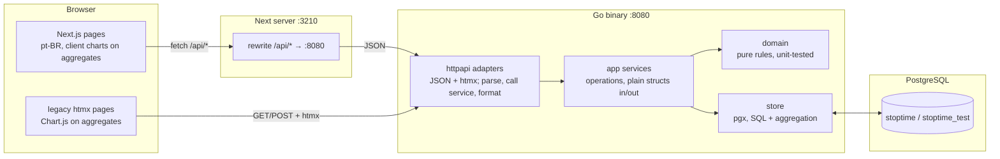

# Architecture

The product is **Terminus** (the working title StopTime survives only in
identifiers: Go module `stoptime`, databases `stoptime`/`stoptime_test`, cookie
`st_session`). Two processes, one PostgreSQL 18 database:

- **`frontend/`** — a Next.js client (App Router, TypeScript, Tailwind CSS,
  pt-BR UI) that speaks only the JSON transports under `/api/*`. Next serves on
  `:3210` and rewrites `/api/*` to the Go server on `:8080` (same-origin
  proxy), so the `st_session` cookie stays first-party. Charts draw the
  aggregate series the API returns; they never sum rows.
- **`backend/`** — one Go binary: the operation services, the JSON transports,
  and the original server-rendered htmx pages, which remain as a **legacy
  transport** (still served, still tested) over the same services.

Every transport is an adapter over an operation-first service contract, so the
switch from htmx to the Next.js client touched only the presentation layer —
the seam this architecture was built for. (Decision 2026-09-29, recorded in
`plans/mvp/notes.md`; it amends the original "no node/npm" rule.)



## Monorepo layout

```
terminus/
├── tp.md                     professor's brief, immutable ground truth
├── AGENTS.md                 agent session protocol (read at session start)
├── README.md                 human entry point: what this is, how to run
├── flake.nix                 optional devshell: go 1.26, postgresql_18, plantuml
├── docs/
│   ├── method.md             multi-session rulebook
│   ├── especificacao.md      part-1 deliverable (pt-BR) + especificacao/diagrams/
│   └── spec/                 this spec set
├── plans/                    session planning (method.md governs it)
├── scripts/                  db-init.sh, db-up.sh, db-down.sh, migrate.sh,
│                             testdb.sh, dev-seed.sh — thin psql/pg_ctl wrappers
├── db/
│   ├── migrations/           ordered plain .sql, applied via psql
│   └── seed/                 golden.sql (tp.md section 5) + golden_check.sql;
│                             demo/demo.sql (dev database only, dev-seed.sh)
├── frontend/                 Next.js client (pnpm), consumes /api/* only
└── backend/                  Go module "stoptime"
    ├── cmd/server/           main.go: config, pool, router, listen
    ├── internal/
    │   ├── domain/           pure rules from business-rules.md, no IO
    │   ├── store/            pgx repositories, SQL aggregation, audit writes
    │   ├── app/              operation services, plain structs, transactions
    │   └── httpapi/          handlers (json + htmx adapters), middleware,
    │                         error mapping
    └── web/                  legacy htmx templates + static assets (htmx,
                              chart.js, css), embedded via go:embed
```

The Next.js client lives in `frontend/` and consumes the `/api/*` adapters;
nothing in `backend/` depends on it. The 12-month synthetic data for RNF03 is
generated by a Go test helper, not a seed file (`plans/mvp/notes.md`, T5).

## Layering rules

These are requirements, not preferences. A review or test that finds a
violation wins.

1. **Handlers only parse, call, and format.** A handler parses the request into
   an operation input, invokes a service function, and renders its output
   (template partial or JSON). Business rules in a handler are a defect.
   Grep guard: `grep -rn "SELECT\|INSERT\|UPDATE\|DELETE" backend/internal/httpapi/`
   must come back empty.
2. **Services speak plain structs.** Every operation has a Go input struct and
   output struct with no HTTP, SQL, or template types. `DashboardByMonth` must
   be callable today from an HTTP handler and tomorrow from a CLI or gRPC
   without changing a line of it.
3. **SQL owns queries and aggregation.** The dashboard series, route totals,
   and cost are computed by SQL (see `business-rules.md`), and the store
   returns them as plain structs. The chart receives aggregate data; it never
   receives raw rows to sum client-side.
4. **Domain is pure.** `internal/domain` holds the RN formulas and validation as
   functions over plain values: no database, no clock reads, no HTTP. Unit
   tests pin them to the golden fixture.
5. **Screens are use cases with states.** `screens.md` defines each screen by
   its states and the operations that feed them, not by markup. Swapping htmx
   for React replaces markup only; the state and operation contracts stay.
6. **Templates render operation outputs.** A template may branch on fields of a
   service struct and nothing else. No template calls the store or recomputes
   business math.

Transactions open in the service (via a store helper), so a composition change
plus its audit row commit or roll back together.

## Operation-first contract (the transport-switch seam)

The API contract in `operations.md` is written per operation: who may call it,
input struct, output struct, typed errors. Each operation then lists its
transports:

- a JSON path under `/api/*` — what the Next.js client uses, and what the
  integration tests drive; and
- an htmx path returning an HTML fragment or a redirect (the legacy
  server-rendered UI, kept and tested).

Both adapters are thin and call the same service function. Errors are sentinel
values in the service (`ErrDriverDateConflict`, `ErrRouteClosed`,
`ErrDepartureBeforeArrival`, `ErrForbidden`, ...); adapters map them to HTTP
status codes and to inline form errors respectively. Adding a transport means
adding an adapter, not changing the service.

## Environment and tooling

- **Toolchain, two supported paths.** (1) The Nix devshell (`flake.nix`, T1):
  Go 1.26, `postgresql_18` (which provides `psql`, `initdb`, `pg_ctl`),
  `gopls`, `plantuml`; enter with `nix develop`. (2) Without Nix (e.g.
  Ubuntu): PostgreSQL 18 binaries from the PGDG apt repository
  (`/usr/lib/postgresql/18/bin`) and Go 1.26 under `/usr/local/go` on PATH —
  the scripts only need the binaries, never the system service (README).
- **Frontend toolchain**: Node 24 + pnpm (`frontend/package.json` pins the
  pnpm version). `pnpm dev` serves on `:3210`; `BACKEND_URL` (default
  `http://127.0.0.1:8080`) is the rewrite target.
- **Repo-local cluster**: `scripts/db-init.sh` runs `initdb` into `.pg/`
  (gitignored), `db-up.sh` starts it and creates the `stoptime` and
  `stoptime_test` databases, `db-down.sh` stops it. The cluster uses a
  unix-socket dir or a non-default port owned by the scripts; nothing global is
  touched.
- **Migrations**: `db/migrations/000N_name.sql`, applied in filename order by
  `scripts/migrate.sh` (psql, one transaction per file, recorded in
  `schema_migrations`). Applied migrations are immutable; fixes are new files.
- **Test database**: `scripts/testdb.sh` drops, recreates, migrates, and
  optionally seeds `stoptime_test`. `go test` integration tests connect to it.
- **Demo data**: `scripts/dev-seed.sh` resets the dev database `stoptime` to
  the golden fixture plus `db/seed/demo/demo.sql` (weeks of routes relative to
  today). It never touches `stoptime_test`.
- **Config**: environment variables only, `.env.example` documents them:
  `DATABASE_URL`, `LISTEN_ADDR` (default `127.0.0.1:8080`), `SESSION_KEY`
  (32+ bytes, required in production, a fixed dev default otherwise).
- **Baseline / parity commands** (every session, per `docs/method.md`):
  from `backend/`, `go build ./... && go vet ./... && go test -count=1 -p 1
  ./internal/...` after the cluster is up (`-p 1`: every package shares
  `stoptime_test`).

## Dependency budget

Backend — allowed, and the complete list:

| Dependency | Why |
| --- | --- |
| `github.com/jackc/pgx/v5` | Postgres driver + pool. The one real dependency. |
| `golang.org/x/crypto` | bcrypt password hashing. Quasi-stdlib. |
| `github.com/google/uuid` | UUID values in plain structs (pgx ships no uuid type; decision in `notes.md`, T4). |
| vendored `htmx.min.js` | legacy UI partial swaps, one file in `backend/web/static/`. |
| vendored `chart.umd.js` | the legacy pages' day/month/period charts. |
| vendored classless CSS (Pico) | the legacy pages' forms and tables. |

Frontend (`frontend/package.json`, decision 2026-09-29): Next.js, React,
Tailwind CSS, TypeScript, the few runtime libraries `package.json` lists (e.g.
a chart library), and their direct tooling (ESLint, Playwright for end-to-end
tests), managed by pnpm. `package.json` is the frontend's budget list; a new
entry there is reviewed like a new Go module. The npm ecosystem stays confined to
`frontend/`: the Go binary, the scripts, and the database workflow need no
Node.

Anything else needs a recorded decision in `plans/mvp/notes.md` first. No ORM,
no migration tool beyond psql, no Docker. The backend's static assets are
served from the binary's `web/` directory; its templates and pages contain no
external URLs (`grep -rn "https://cdn" backend/` stays empty).

## Security

- Passwords: bcrypt, cost 10.
- Sessions: HMAC-SHA256 signed cookie `st_session` carrying user id, role, and
  expiry; 12h lifetime; HttpOnly; SameSite=Lax; Secure when serving over TLS.
  Logout clears the cookie. Accepted tradeoff (no server-side revocation)
  recorded here; upgrade path is a `session` table behind the same middleware.
- Authorization: role checks live in services, not just middleware, so every
  caller (Next.js via JSON, legacy htmx, future CLI) enforces the same matrix.
  The Next.js proxy's cookie check is only an optimistic redirect to login;
  the Go API decides whether a session is valid (`CurrentUser`). Driver scoping
  (own routes only) is a query-level filter, not a post-filter.
- Input: forms and JSON are decoded into structs and validated in the service;
  the store parameterizes every query (pgx); templates escape by default.
- Errors: adapters map sentinel errors to status codes; internal errors log
  server-side and return a generic body. No stack traces or SQL text to the
  client.

## Performance (RNF03)

Aggregation happens in one SQL query per dashboard cut, scanning indexed
`route(route_date)` and joining `route_stop`. No per-row loops in Go. T5
generates 12 months of synthetic routes and asserts wall-clock under 3s and
`EXPLAIN ANALYZE` using an index scan. At MVP data volume this is trivial; the
test guards the pattern, not just the number.

## Timezone policy

`timestamptz` in UTC everywhere; `route_date` is a `date` (no time component).
The server renders timestamps in America/Sao_Paulo; JSON returns RFC 3339 with
offset. "Now" for a driver's mark-arrival tap is server time, recorded once.
The golden seed uses -03:00 offsets so conversion bugs surface in tests.
