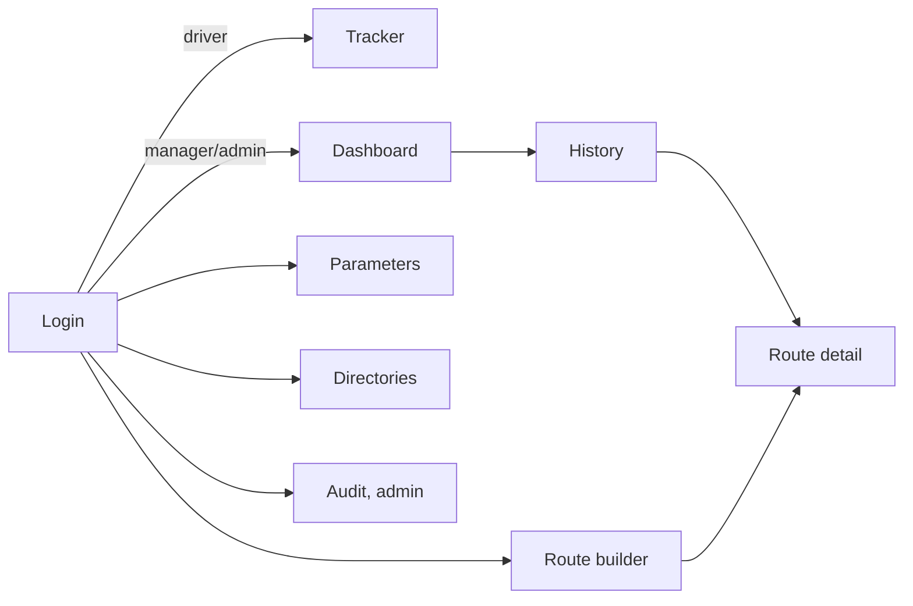

# Screens

Each screen is defined by its use case, its states, and the operations that
feed it. Markup is not part of the contract. The screens are realized by the
**Next.js client** in `frontend/` (pt-BR UI, over the `/api/*` JSON
transports; decision 2026-09-29, `architecture.md`); the original server-rendered
htmx pages in `backend/web/` realize the same states over the same operations
and remain as a legacy transport. Screen names below (Route builder, Route
tracker, Dashboard, History, ...) are the contract's names; the Next.js routes
and pt-BR labels are presentation. The htmx pages keep one labels map per
screen (English defaults). On boot the Next.js client confirms the session with
`CurrentUser` (`GET /api/auth/me`) before rendering any screen below.

## 1. Login

Actor: anyone with an account.

| State | Shows | Actions |
| --- | --- | --- |
| entry | email + password form | submit |
| invalid | form with error message | retry |
| success | redirect by role: driver → tracker, manager/admin → dashboard | — |

Operations: Login, Logout (from the layout).

## 2. Route builder (manager/admin)

Use case: compose tomorrow's route for a driver: pick driver, date, and an
ordered list of locations (RF04).

| State | Shows | Actions |
| --- | --- | --- |
| empty | driver picker, date picker, empty stop list, location search | add stop, submit |
| adding points | current ordered stop list (1..n, stop 1 marked "departure"), location search results | add next, move up/down, remove |
| reordering | same list with move controls emphasized | move up/down (one position per action) |
| invalid | field errors inline: no driver, no date, fewer than 2 stops, driver already has a route that date (links to it) | fix and submit |
| saving | disabled submit, list frozen | — |
| saved | success message with link to the route detail | build another |

Operations: CreateRoute, AddStop, RemoveStop, ReorderStops, ListDrivers,
ListLocations.

## 3. Route tracker (driver, phone-first; manager/admin read-only)

Use case: run the day: start the route, mark arrival and departure at each
stop, set distance, close (RF05, RN01, RN06).

| State | Shows | Actions |
| --- | --- | --- |
| not started | own route for today (or "no route assigned"), stop list | start route |
| active, next stop pending | stop list with current stop highlighted, no stopwatch on stop 1 | mark arrival (now) |
| arrived at n | arrival time shown, stopwatch running | mark departure (now), enter manual time |
| departed n | stop n done with its minutes; next stop highlighted | mark arrival |
| completed | all stops done; distance field if empty | set distance, close route |
| closed | summary: total stopped minutes, journey percent, cost | — |
| error | inline error (stop order wrong, invalid manual time) | retry |

Manual time entry: the driver may type a timestamp for a stop whose field is
still null (caught-up data entry). Corrections of already-set times are
manager/admin and route through UpdateStopTimes (audited).

Operations: StartRoute, RecordArrival, RecordDeparture, SetRouteDistance,
CloseRoute, GetRoute.

## 4. Dashboard (manager/admin)

Use case: see stopped time per day, month, and arbitrary period (RF08).

| State | Shows | Actions |
| --- | --- | --- |
| selecting | preset chips (today, 7 days, this month, 12 months) + custom from/to | pick |
| loading | skeleton per tab | — |
| rendered | three tabs: day series (bar), month series (bar), period summary + per-driver ranking; journey percent per bucket; charts receive aggregate series only | switch tab, change range |
| empty | "no stops recorded in this period" with a hint to widen it | change range |
| error | error message with retry | retry |

Operations: GetDashboardByDay, GetDashboardByMonth, GetDashboardByPeriod.
Chart data reaches the page as aggregate series (SQL-computed); the chart never
sums rows.

## 5. History (manager/admin; driver sees own)

Use case: consult points and stopped times for a period with addresses, open a
route, export (RF07, RF12).

| State | Shows | Actions |
| --- | --- | --- |
| filtering | from/to, driver filter, status filter | apply |
| list | rows: date, driver, stops, total minutes, percent, cost, status | open route |
| detail | route detail with every stop's address and timestamps, totals, cost; corrections form for manager/admin (audited); back | export CSV, back |
| empty | no routes in range | change range |
| error | inline error | retry |

Operations: ListRoutes, GetRoute, UpdateStopTimes (corrections), ExportPeriodCSV.

## 6. Directories: drivers, managers, locations (manager/admin)

Use case: register people and points (RF01, RF02, RF03).

| State | Shows | Actions |
| --- | --- | --- |
| list | table with rows and active state | new, edit |
| form-new / form-edit | fields per operation input; drivers include vehicle + km/l | save, cancel |
| invalid | inline field errors (duplicate email, malformed input) | fix |
| saved | back to list with success message | — |

Operations: CreateDriver, UpdateDriver, ListDrivers, CreateManager,
ListManagers, CreateLocation, UpdateLocation, ListLocations.

## 7. Parameters (manager/admin)

Use case: set cost and calculation parameters without code changes (RF09, RF10,
acceptance criterion 4).

| State | Shows | Actions |
| --- | --- | --- |
| viewing | fuel price, cost per km, default km/l, journey hours (8), min stop minutes; each with last-updated info | edit value |
| invalid | non-numeric or negative rejected inline | fix |
| saved | new value; audit row written | — |

Operations: GetParams, UpdateParam.

## 8. Audit (admin)

Use case: inspect changes to points and times (RNF05).

| State | Shows | Actions |
| --- | --- | --- |
| filtering | entity, date range | apply |
| list | when, who, entity, action, old → new values | filter |

Operations: ListAudit.

## Navigation map

