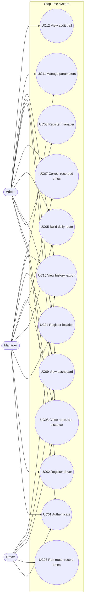
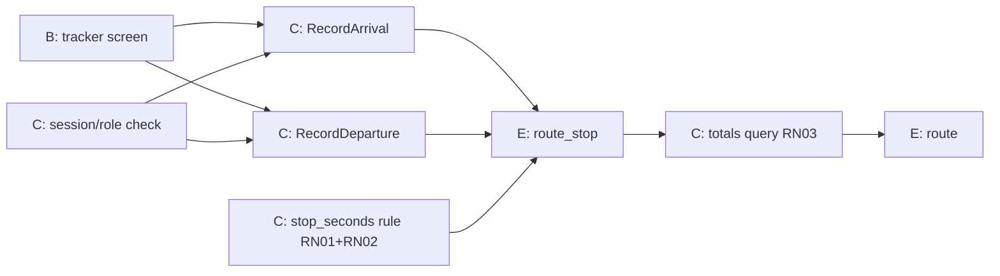
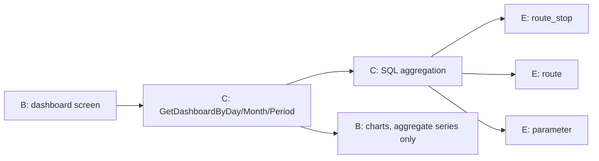
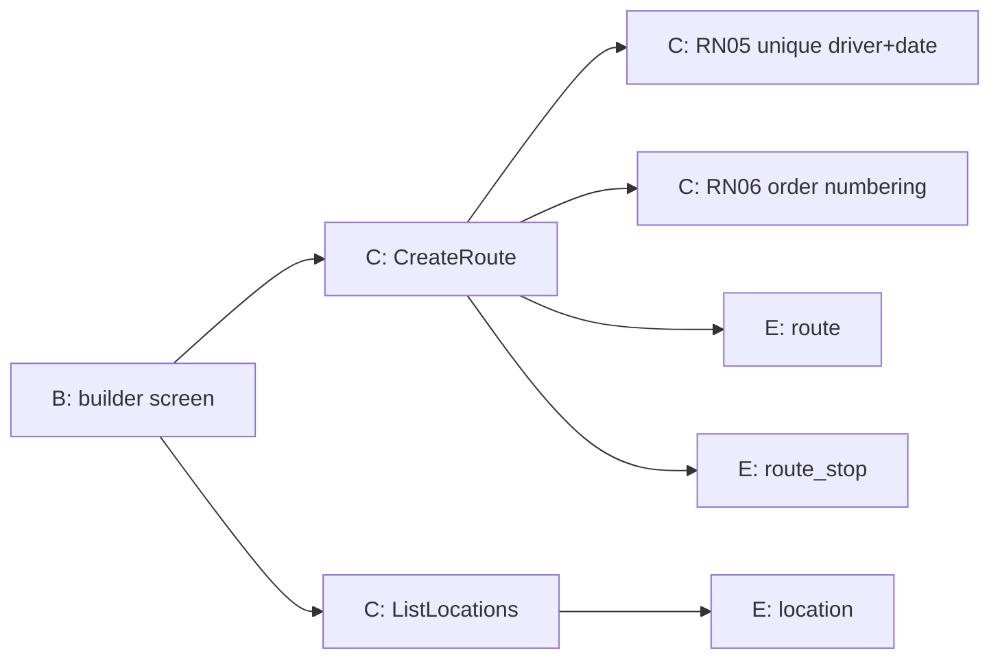
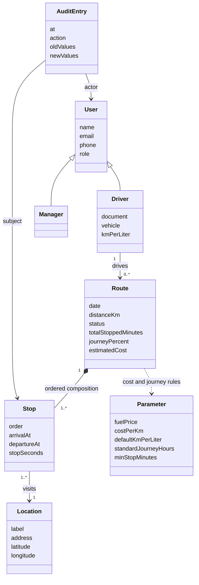

# Use cases and UML drafts (part 1 deliverable)

English working source for the part-1 deliverable. The submission artifact is
`docs/especificacao.md` (Portuguese prose, verbatim English identifiers) with
its diagrams in `docs/especificacao/diagrams/`: PlantUML for use case,
robustness, and class diagrams (sources `.puml`, rendered `.svg` committed
alongside), Mermaid for the crow's foot ER. This file keeps the
engineering-facing descriptions and the UC-to-operations traceability; the
mermaid sketches below are quick-look drafts, not the deliverable format. When
a use case changes, both files change in the same commit; card T10 reviews the
pair against the finished implementation.

## Actors

- **Driver** (courier / motoboy): runs routes, records arrival and departure.
- **Manager** (coordinator / dispatcher): builds routes, corrects times,
  reads dashboards and history, sets parameters.
- **Admin** (company owner / system administrator): everything a manager does,
  plus manager accounts, audit trail, route reopening.

## Use case list

| ID | Use case | Actor(s) | Main requirement |
| --- | --- | --- | --- |
| UC01 | Authenticate | all | RNF04 |
| UC02 | Register driver | Admin, Manager | RF01 |
| UC03 | Register manager | Admin | RF02 |
| UC04 | Register location (point) | Admin, Manager | RF03 |
| UC05 | Build daily route | Manager, Admin | RF04 |
| UC06 | Run route and record times | Driver (Manager/Admin substitute) | RF05, RF06 |
| UC07 | Correct recorded times | Manager, Admin | RF05, RNF05 |
| UC08 | Close route and set distance | Driver, Manager, Admin | RF11 |
| UC09 | View dashboard | Manager, Admin (own data: Driver) | RF08, RNF03 |
| UC10 | View history and export | Manager, Admin (own data: Driver) | RF07, RF12 |
| UC11 | Manage cost and journey parameters | Manager, Admin | RF09, RF10, RF11 |
| UC12 | View audit trail | Admin | RNF05 |

## Use case diagram

## Use case descriptions

### UC05 — Build daily route

Actor: Manager (Admin substitutes).
Precondition: driver and locations registered.
Main flow:
1. Manager picks a driver and a date.
2. System checks no route exists for that driver and date (RN05).
3. Manager adds locations in visit order; system numbers stops 1..n (RN06).
4. Manager submits; system persists the route with stop 1 as departure point
   and status `draft`.
Alternative flows: (2a) route exists → system shows it and links to it
(RN05); (3a) fewer than 2 stops → system rejects with a field error;
(4a) persist fails → system shows error, list stays editable.
Postcondition: a draft route exists with ordered stops; audit trail notes
composition changes made after creation.

### UC06 — Run route and record times

Actor: Driver.
Precondition: a route for today exists (status active).
Main flow:
1. Driver opens the tracker; system shows today's own route.
2. Driver starts the route.
3. At each stop from the second onward (RN01), driver marks arrival; the system
   stores the server timestamp.
4. On leaving, driver marks departure; the system stores the timestamp.
5. System computes stopped time per stop as departure minus arrival (RN02) and
   the route total as the sum over counted stops (RN03).
Alternative flows: (1a) no route today → empty state with hint to contact the
coordinator; (3a) driver is catching up → manual timestamp entry for a null
field; (4a) no network → retry on reconnect, timestamps only move forward via
corrections.
Postcondition: every counted stop has arrival and departure; totals visible.

### UC07 — Correct recorded times

Actor: Manager (Admin).
Precondition: the route exists and is not closed.
Main flow:
1. Manager opens the route detail in history.
2. Manager edits an arrival or departure timestamp.
3. System validates departure ≥ arrival (RN02) and persists the change.
4. System writes an audit row with old and new values (RNF05).
5. Totals recompute on next read.
Alternative flows: (3a) invalid pair → reject with field error, no audit row;
(3b) route closed → reject (reopen is an admin action, audited).
Postcondition: the correction is persisted and traceable.

### UC08 — Close route and set distance

Actor: Driver (Manager/Admin substitute).
Precondition: route active, stops recorded.
Main flow:
1. Driver enters total distance traveled (odometer or estimate).
2. Driver closes the route.
3. System freezes composition and times; cost is computed per RN07 from
   current parameters; the journey percent per RN04 shows against the
   8-hour standard.
Postcondition: route read-only; totals, percent, and cost final for that read.

### UC09 — View dashboard

Actor: Manager/Admin (driver sees own data).
Main flow:
1. Actor picks a period (preset or custom range).
2. System aggregates stopped minutes per day, per month, and the period total
   in SQL.
3. System renders the three cuts as charts, with journey percent per bucket
   (RN04).
Performance: under 3s for a 12-month range (RNF03), verified by a seeded test.

### UC11 — Manage parameters

Actor: Manager/Admin.
Main flow:
1. Actor opens the parameters screen; system lists fuel price, cost per km,
   default km/l, journey hours, min stop minutes.
2. Actor edits a value; system validates and persists.
3. System writes an audit row; later reads recalculate costs and percents with
   the new values (acceptance criterion 4: no code changes).

The remaining use cases (UC01–UC04, UC10, UC12) follow the same shape and map
one-to-one to the operations in `operations.md`; T10 fills their full
descriptions into the submission document.

## Robustness diagrams (core flows)

Mermaid has no robustness notation; these use flowchart nodes labeled
B (boundary), C (control), E (entity) as the draft. T10 re-renders in whatever
the submission requires.

### UC06 — record times

### UC09 — dashboard

### UC05 — build route

## Conceptual class diagram

Notes for T10: derived attributes (`totalStoppedMinutes`, `journeyPercent`,
`estimatedCost`, `stopSeconds`) are computed, never stored; the class diagram
marks them as derived ("/" notation in the final document). The `Parameter`
class is singleton-ish per key, shown here as one class for readability.

## Traceability

Every UC maps to requirements and to operations:

| UC | Requirements | Operations |
| --- | --- | --- |
| UC01 | RNF04 | Login, Logout |
| UC02 | RF01 | CreateDriver, ListDrivers |
| UC03 | RF02 | CreateManager, ListManagers |
| UC04 | RF03 | CreateLocation, ListLocations |
| UC05 | RF04, RN05, RN06 | CreateRoute, AddStop, RemoveStop, ReorderStops |
| UC06 | RF05, RF06, RN01, RN02, RN03 | RecordArrival, RecordDeparture, StartRoute |
| UC07 | RNF05, RN02 | UpdateStopTimes |
| UC08 | RF11, RN07, RN04 | CloseRoute, SetRouteDistance |
| UC09 | RF08, RNF03, RN04 | GetDashboardBy* |
| UC10 | RF07, RF12 | ListRoutes, GetRoute, ExportPeriodCSV |
| UC11 | RF09, RF10 | GetParams, UpdateParam |
| UC12 | RNF05 | ListAudit |
